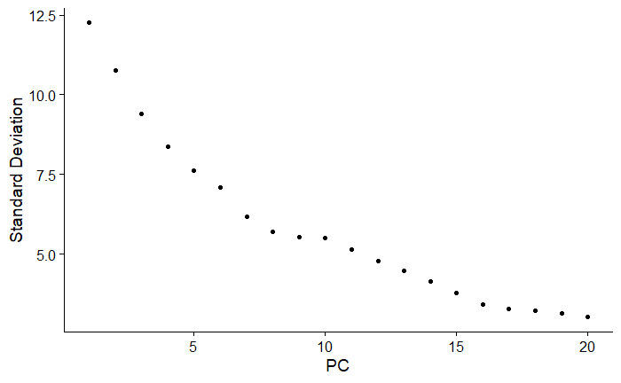
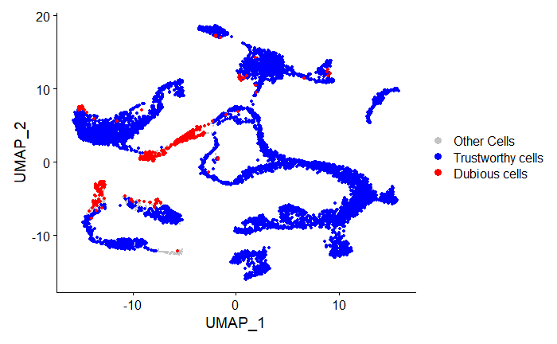
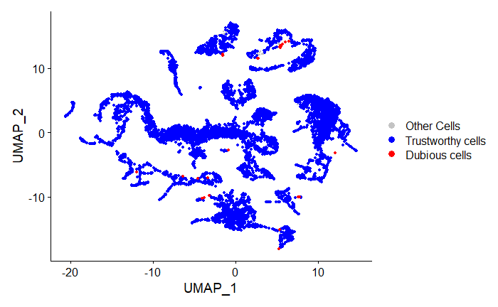
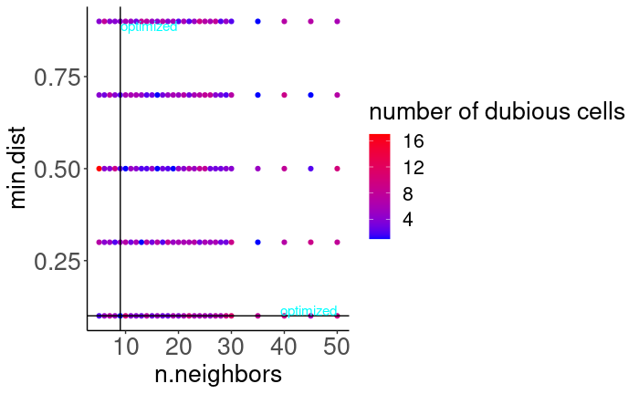
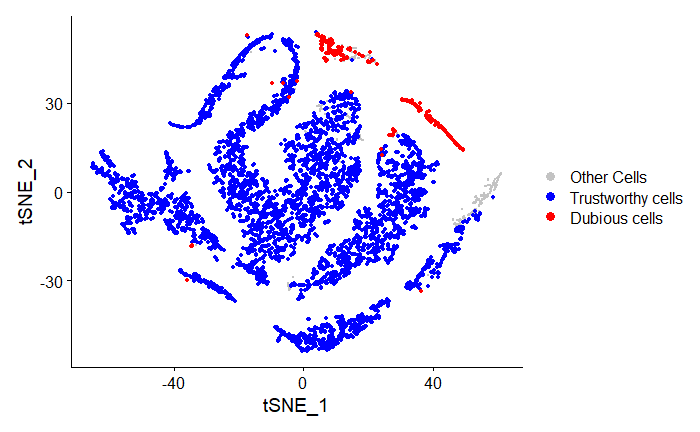
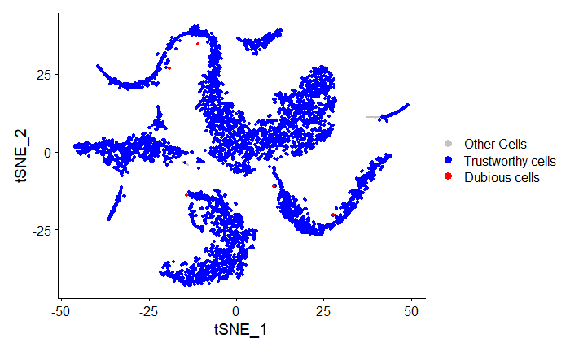
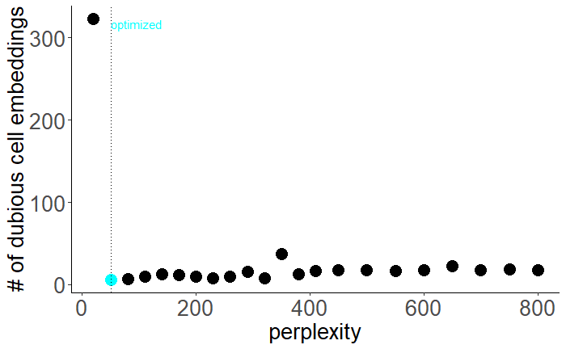

<!-- README.md is generated from README.Rmd. Please edit that file -->

# scDEED (single-cell dubious embeddings detector): a statistical method for detecting dubious non-linear embeddings
- This package is used to determine the reliability of non-linear dimension reduction embeddings. It provides functions to detect dubious cells and trustworthy cells in tSNE and UMAP embeddings. The position of dubious cells in the 2D-embedding space differs from their relative position in the high-dimensional space. Furthermore, by minimizing the number of dubious cells, functions in this package find the best perplexity parameter of tSNE and the best n.neighbors/min.dist parameter of UMAP.

## Inputs and hyperparameters
-  The number of PCs to use (num_pc). The user may choose this based on any criteria, such as an elbow plot. 

- Input count matrix should contain cells as columns and genes as rows

- Dimension reduction method (use_method). Currently, the package supports tSNE and UMAP, both implemented through the Seurat package.

## Installation
You can install scDEED from GitHub using devtools. It should install in 1 minute, but may take longer if you need to update dependencies. 

``` r
library(devtools)
devtools::install_github("JSB-UCLA/scDEED")
```

## Example

This is a basic example showing how to find the best parameter. If users use our example input data and the default parameter list(s), users can get the result in about 2mins
We use an example input data which is generated by randomly sampling 10000 cells from Hydra dataset as a demo:

``` r
suppressPackageStartupMessages(library(scDEED))
data(input_counts)
```

### Choose the suitable dimension for PCA (num\_pc)

``` r
chooseK(input_counts)
```
ChooseK plot:

 

### Example for umap

``` r
umap_example <- scDEED(input_counts , num_pc = 16, use_method = "umap",visualization = TRUE)
```

``` r
head(umap_example$`number of dubious cells corresponding to pair of n.neighbors and min.dist list`)
```
|   | n.neighbors | min.dist | number of dubious cells |
|---|-------------|----------|-------------------------|
| 1 | 5           | 0.1      | 42                       |
| 2 | 6           | 0.1      | 54                       |
| 3 | 7           | 0.1      | 39                      |
| 4 | 8           | 0.1      | 76                       |
| 5 | 9           | 0.1      | 29                       |
| 6 | 10           | 0.1      | 43                       |

``` r
umap_example$`best pair of n.neighbors and min.dist`
```
5 0.5


Comparative UMAP plots of the randomly selected 10000 cells from Hydra dataset under the n.neighbors 50, min.dist 0.7 and the n.neighbors 5, min.dist 0.5
optimized by scDEED:

Before optimization:


After optimization:



``` r
umap_example$`plot. # of dubious embeddings vs pair of n.neighbors and min.dist`
```
Plot of number of dubious embeddings vs pair of n.neighbors and min.dist for UMAP:
 


### Example for tsne

``` r
tsne_example <- scDEED(input_counts, num_pc = 10, use_method = "tsne",visualization = TRUE)
```

``` r
head(tsne_example$`number of dubious cells corresponding to perplexity list`)
```

|   |  perplexity |  number of dubious cells |
| - | ----------- | ------------------------ |
| 1 | 	20         | 	323                      |
| 2 | 	50         | 	6                      |
| 3 | 	80         | 	7                      |
| 4 | 	110        | 	10                      |
| 5 | 	140        | 	13                      |
| 6 | 	170        | 	12                      |


``` r
tsne_example$`best perplexity`
```
50


Comparative tSNE plots of the randomly selected 10000 cells from Hydra dataset under the perplexity 20 and the perplexity 50
optimized by scDEED:

Before optimization:
 

After optimization:
 

``` r
tsne_example$`plot. # of dubious embeddings vs parameters`
```
Plot of number of dubious embeddings vs parameters for tSNE:
 
