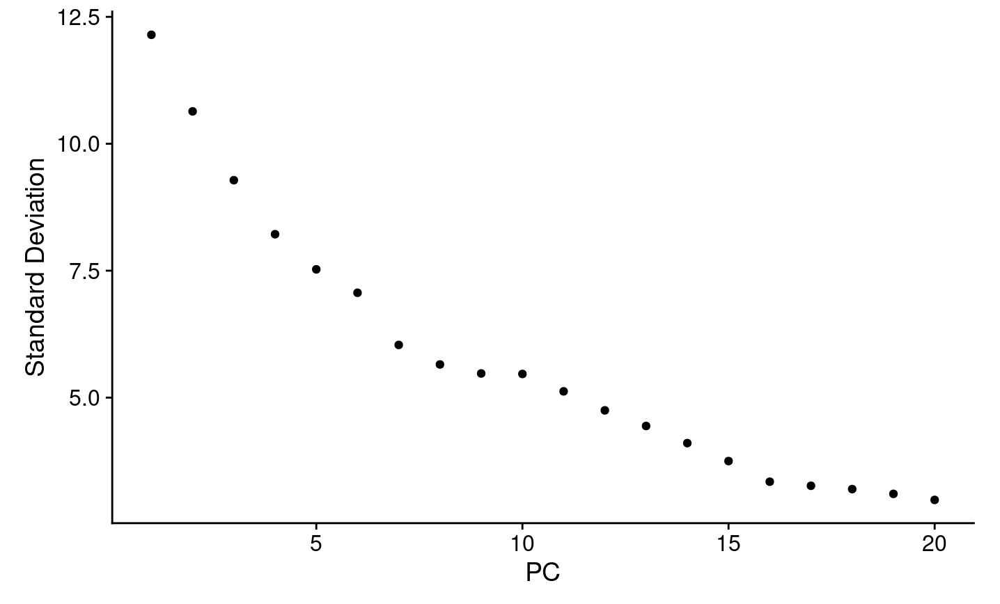
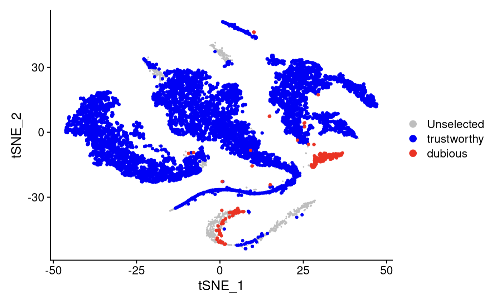
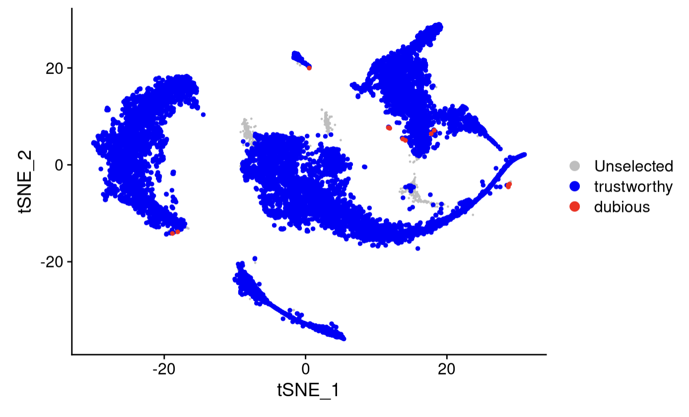
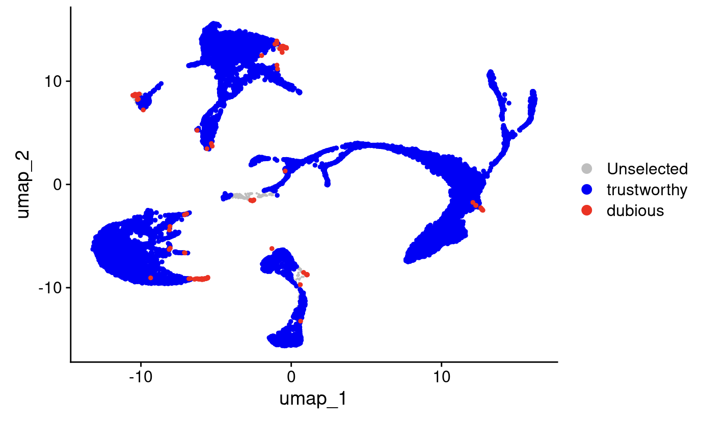

[](https://doi.org/10.5281/zenodo.8371425)
<!-- README.md is generated from README.Rmd. Please edit that file -->

# scDEED (single-cell dubious embeddings detector): a statistical method for detecting dubious non-linear embeddings
Visualization methods like t-SNE and UMAP are sensitive to hyperparameter selection. scDEED helps find optimal hyperparameter values for dimension reduction methods by minimizing the number of dubious cell embeddings. A cell embedding is considered 'dubious' if the cell's neighbors before and after the embedding differ drastically. We measure this by comparing the pearson correlation of ordered distances between a cell and its nearest neighbors in the pre-embedding space and its nearest neighbors in the post-embedding space. An intuitive way to select optimal hyperparameters is by minimizing the number of dubious cell embeddings, thus providing a visualization that most faithfully represents the high dimensional, pre-embedding space. 

The manuscript is available at [Nature Communications](https://www.nature.com/articles/s41467-024-45891-y)

We also have a post on [TowardsDataScience](https://towardsdatascience.com/statistical-method-scdeed-detects-dubious-t-sne-and-umap-embeddings-and-optimizes-hyperparameters-470fb9cb606f)

Currently, the package supports tSNE and UMAP, both implemented through the Seurat package. We do have a section in the tutorial if you would like to adapt scDEED for use with other dimension reduction methods. 

## Installation
You can install scDEED from GitHub using devtools. It should install in 1 minute, but may take longer if you need to update dependencies.  

``` r
library(devtools)
devtools::install_github("JSB-UCLA/scDEED")

#these are other packages that are useful
library(Seurat)
library(gridExtra)
library(dplyr)
library(patchwork)
library(VGAM)
library(gplots)
library(ggplot2)
library(pracma)
library(resample)
library(foreach)
library(distances)
library(utils)
library(doParallel)
##You can change the number of cores here
#registerDoParallel(cores=6)
```

## Tutorial


First we will load the data. scDEED uses Seurat objects. This input_counts contains 10000 randomly selected cells from the Hydra dataset. 
``` r
load("input_counts.rda")
data = CreateSeuratObject(input_counts)
data = NormalizeData(data)
data = ScaleData(data)
data = FindVariableFeatures(data)
data = RunPCA(data)
```


The user must specify the input dimension for the high dimensional space (`K`). There are many ways the users can decide how many dimensions to use. A quick method may be to use an elbow plot. 

By default, the pre-embedding space is the PCA space, although this can also be changed if the user wishes (more detail in section: Changing Input Space)

``` r
Seurat::ElbowPlot(data)
```

 

Now we can use scDEED to optimize the hyperparameters for UMAP and t-SNE. scDEED will search the provided `perplexity` values (for t-SNE) or `min.dist` and `n_neighbors` values (for UMAP) and calculate the number of dubious cell embeddings at each value. The output is a data.frame with number of dubious cell embeddings found at each hyperparameter value. 

If there is more than 1 hyperparameter setting to check, scDEED will provide an estimate for how long the code will take. It calculates this by timing how long 1 hyperparameter setting takes- so please be patient as it may take a few minutes. 

### Inputs

- `K`: the number of PCs to use. This must be specified by the user. 
- `similarity_percent`: (default = 0.5) the percentage of neighboring cells to consider in the calculations. A higher similarity percent will consider more cells (global focus), while a smaller similarity percent will consider less cells (local focus). For a full exploration of similarity percent, please see the Methods section in our paper
- `pre_embedding`: (default = 'pca') the input space for t-SNE/UMAP; by default the input space is the PC space. If you would like to change this, please see section: Changing Input Space
- `dubious_cutoff`: (default = 0.05) This sets the cutoff for classifying cells. For an embedding to be considered dubious, the cell's similarity score must be lower than the 5th percentile of cell embedding scores from the null distribution. 
- `trustworthy_cutoff`: (default = 0.95) For an embedding to be considered trustworthy, the cell's similarity score must be higher than the 95th percentile of cell embedding scores from the null distribution. 

Together, the dubious and trustworthy cutoffs determine the intermediate cells. Intermediate cells have similarity scores within the 5th and 95th percentile of the null distribution. In practice, most cell embeddings will be trustworthy, and a smaller number will be dubious or intermediate. 

- `reduction.method`: the dimension reduction method to use. The package is set up for t-SNE and UMAP, but can be adapted to other dimension reduction methods (see section: Adapting to Other Dimension Reduction Methods)
  * For t-SNE: reduction.method = 'tsne'
    - `perplexity`: The default perplexity values are: 20 to 410, increasing by 30 and 450 to 800, increasing by 50 
  
  * For UMAP: reduction.method = 'umap'
    - `min.dist`: The default min.dist values are: 0.1 and 0.4
    - `n_neighbors`:The default n_neighbors values are: 5, 20, 30, 40, 50
    - The grid search (due to two hyperparameters, rather than one) can be computationally expensive. Depending on the user's resources and time constraints, more hyperparameter options can be added by changing the min.dist or n_neighbors argument. 

### Outputs
The scDEED function returns a list of 2 items: 
- `num_dubious`: This is a data.frame that shows the hyperparameter settings and the number of dubious cells at those hyperparameter settings 

- `full_results`: This is a data.frame that shows the hyperparamater settings as well as the dubious/trustworthy/intermediate cells. The cell classifications at each hyperparameter setting are available in the last 3 columns, separated by commas. 

``` r
K = 8

start = Sys.time()
result = scDEED(data, K = K, reduction.method = 'tsne', perplexity = seq(from = 20, to = 410, by = 30))
end = Sys.time()
time_elapse = data.frame(start = start, end = end, type = 'tsne')

start = Sys.time()
result_umap = scDEED(data, K = K, reduction.method = 'umap')
end = Sys.time()
time_elapse = bind_rows(time_elapse, data.frame(start = start, end = end, type = 'umap'))
best_perplexity = which(result$`number of dubious cells`==min(result$`number of dubious cells`))
saveRDS(result, 'tutorial_tSNE.Rds')
saveRDS(result_umap, 'tutorial_umap.Rds')
saveRDS(time_elapse, 'tutorial_timeelapsed.Rds')

head(result_umap$num_dubious)
```
|   | n_neighbors | min.dist | number_dubious_cells |
|---|-------------|----------|-------------------------|
| 1 | 5           | 0.1      | 264                       |
| 2 | 20           | 0.1      | 113                       |
| 3 | 30           | 0.1      | 120                      |
| 4 | 40           | 0.1      | 115                       |
| 5 | 50           | 0.1      | 114                       |
| 6 | 5           | 0.4      | 313                       |

For t-SNE, the format is similar, but there are only two columns (perplexity and number_dubious_cells). 
The above takes some time to run- about 68 minutes for t-SNE, about 29 minutes for UMAP. 
``` r
result <- readRDS("~/R/scDEED/tutorial_tSNE.Rds")
result_umap <- readRDS("~/R/scDEED/tutorial_umap.Rds")
## to access the dubious cells at a given perplexity, like 50, we use the dubious cells column
dubious_cells = result$full_results$dubious_cells[result$full_results$perplexity=='50']
dubious_cells = as.numeric(strsplit(dubious_cells, ',')[[1]])
trustworthy_cells =  result$full_results$trustworthy_cells[result$full_results$perplexity=='50']
trustworthy_cells = as.numeric(strsplit(trustworthy_cells, ',')[[1]])
data_50 = RunTSNE(data, seed.use = 100, perplexity = 50)

DimPlot(data_50, reduction = 'tsne', cells.highlight = list('dubious' = dubious_cells, 'trustworthy' = trustworthy_cells)) + scale_color_manual(values = c('gray', 'blue', 'red'))
``` 
At perplexity 50: 


``` r
min(result$num_dubious$number_dubious_cells)
result$num_dubious$perplexity[result$num_dubious$number_dubious_cells==min(result$num_dubious$number_dubious_cells)]
# optimized perplexity is 200 with 15 dubious cells
dubious_cells = result$full_results$dubious_cells[result$full_results$perplexity=='200']
dubious_cells = as.numeric(strsplit(dubious_cells, ',')[[1]])
trustworthy_cells =  result$full_results$trustworthy_cells[result$full_results$perplexity=='200']
trustworthy_cells = as.numeric(strsplit(trustworthy_cells, ',')[[1]])
data_opt = RunTSNE(data, seed.use = 100, perplexity = 200)

DimPlot(data_opt, reduction = 'tsne', cells.highlight = list('dubious' = dubious_cells, 'trustworthy' = trustworthy_cells)) + scale_color_manual(values = c('gray', 'blue', 'red'))

``` 
At the optimized perplexity of 200:


Similarly for UMAP:
``` r
min(result_umap$num_dubious$number_dubious_cells)
opt = which(result_umap$num_dubious$number_dubious_cells==min(result_umap$num_dubious$number_dubious_cells))
m = result_umap$num_dubious$min.dist[opt]
n = result_umap$num_dubious$n_neighbors[opt]

dubious_cells = result_umap$full_results$dubious_cells[opt]
dubious_cells = as.numeric(strsplit(dubious_cells, ',')[[1]])
trustworthy_cells =  result_umap$full_results$trustworthy_cells[opt]
trustworthy_cells = as.numeric(strsplit(trustworthy_cells, ',')[[1]])
data_opt = RunUMAP(data_opt, dims = 1:K, min.dist = m, n.neighbors = n, seed.use = 100)


DimPlot(data_opt, reduction = 'umap', cells.highlight = list('dubious' = dubious_cells, 'trustworthy' = trustworthy_cells)) + scale_color_manual(values = c('gray', 'blue', 'red'))

```



## Changing Input Space
Users may want to change the pre-embedding space. For example, if the feature space is small, users may not want to use the PC space and just use the feature space directly. In the case of scRNA-seq data, we would recommend against using the gene expression space because euclidean distances may not be reliable at high dimensions. 

To use a different high dimensional space, the user should add this assay as a reduced dimension to the Seurat object and specify this using `pre_embedding`. For illustration purposes, we pretend we want to only use the first 50 genes as a new dimension space, and we downsample again to 500 cells. 

``` r
set.seed(1)
keep = sample(1:1000, 500)
data = data[, keep]

gene_exp = as.matrix(t(GetAssayData(data, slot = 'scale.data')[1:50, ]))

##Seurat requires that the column names be key_1, key_2...in this case the key is 'gene'
colnames(gene_exp) = paste('genes_', 1:50)
data[["gene_expression"]] <- CreateDimReducObject(embeddings =gene_exp , key = "genes_", assay = DefaultAssay(data))

## we then permute the data, and apply the dimension reduction method. The 'Permuted' function will shuffle each row of the data slot indicated (default is scale.data). The user can still use the Permuted function to permute the data matrix and apply their chosen method to the permuted data. Note that the method users apply must use the data slot that has been permuted, ie for RunPCA, Seurat uses the scale.data slot, so we must use Permuted(slot = 'scale.data'). 

data.permuted = Permuted(data,  default_assay = 'RNA', slot = 'scale.data', K)
gene_exp = as.matrix(t(GetAssayData(data, slot = 'scale.data')[1:50, ]))

##Seurat requires that the column names be key_1, key_2...in this case the key is 'gene'
colnames(gene_exp) = paste('genes_', 1:50)
data.permuted[["gene_expression"]] <- CreateDimReducObject(embeddings =gene_exp , key = "genes_", assay = DefaultAssay(data.permuted))

## we then tell the scDEED function to use our provided permuted data, instead of running PCA. We also tell it to ignore duplicates- with only 50 genes, it is possible that there are some duplicates
result = scDEED(data, K = 8, pre_embedding = 'gene_expression', permuted = data.permuted, reduction.method = 'tsne', perplexity = c(10, 20), check_duplicates = F)

```
> [1] "Estimating time for each hyperparameter setting..."
> 
> [1] "Estimated time per hyperparameter setting "
> 
> Time difference of 4.409245 secs
> 
> [1] "Estimated time of completion"
> 
> [1] "2024-04-08 17:14:27 PDT"


## Adapting to Other Dimension Reduction Methods
The user can use the functions in scDEED to adapt to other dimension reduction methods. The user will need to specify the input parameters, and apply the dimension reduction method to both the original and permuted data. 
As an example here using t-SNE: 

``` r
data.permuted = Permuted(data, K = K)
### We are still using the PCA space as the pre-embedding method. If this is not the case, you can adjust the pre-embedding method by adding it as a reduced dimension space to the object, as in the previous code block 
results.PCA = Distances.pre_embedding(data, data.permuted, K=K, pre_embedding = 'pca')

## apply the embedding method to the permuted and original data using the hyperparameter settings specified by the grid search. In this case, we are checking perplexity 10. original should be the cell embeddings for the original data, and permuted should be the cell embeddings for the permuted data

original = RunTSNE(data, perplexity = 10)
original = original@reductions$tsne@cell.embeddings
reduced_dim_distances = distances::distances(original)

permuted = RunTSNE(data.permuted, perplexity = 10)
permuted = permuted@reductions$tsne@cell.embeddings
reduced_dim_distances_permuted = distances::distances(permuted)

#Calculate similarity scores for each cell 
  similarity_score <-Cell.Similarity(results.PCA$pre_embedding_distances,results.PCA$pre_embedding_distances_permuted,reduced_dim_distances,reduced_dim_distances_permuted, similarity_percent=0.5)

#Classify cells
  ClassifiedCells<-Cell.Classify(similarity_score$rho_original,similarity_score$rho_permuted, dubious_cutoff = 0.95, trustworthy_cutoff = 0.95)

num_dubious_cells = ClassifiedCells$dubious_cells

##for optimization, the user would need to loop over the possible hyperparameter settings

```


