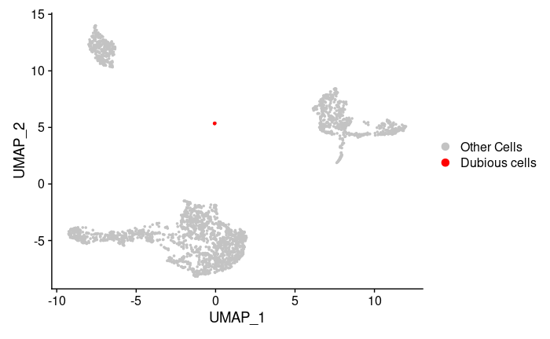
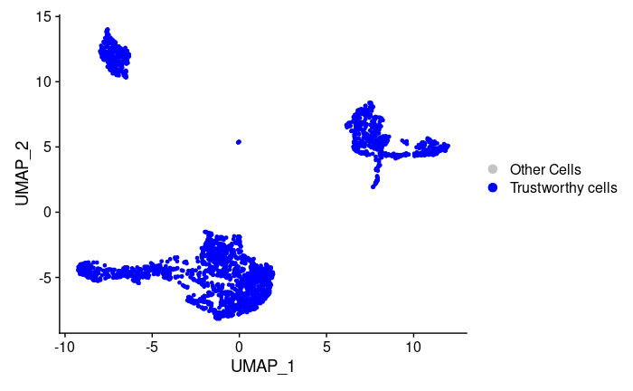

<!-- README.md is generated from README.Rmd. Please edit that file -->

# scDEED (single-cell dubious embeddings detector): a statistical method for detecting dubious non-linear embeddings
- This package is used to determine the reliability of non-linear dimension reduction embeddings. It provides functions to detect dubious cells and trustworthy cells in tSNE and UMAP embeddings. Furthermore, by minimizing the number of dubious cells, functions in this package find the best perplexity parameter of tSNE and the best n.neighbors/min.dist parameter of UMAP.

- Choose the suitable dimension for PCA (num_pc)

- Input count matrix should contain cells as columns and genes as rows

## Installation
You can install the released version of scDEED from GitHub with:

``` r
library(devtools)
devtools::install_github("JSB-UCLA/scDEED")
```

## Example

This is a basic example showing how to find the best parameter.
We use pmbc data as a demo:

``` r
suppressPackageStartupMessages(library(scDEED))
data(pbmc.data)
```

### Choose the suitable dimension for PCA (num\_pc)

``` r
chooseK(pbmc.data)
```
ChooseK plot:

 

### Example for umap

``` r
umap_example <- umap_tsne_process(pbmc.data , num_pc = 10, use_method = "umap",visualization = TRUE)
```

``` r
head(umap_example$`UMAP plot with dubious cells - best pair of n.neighbors and min.dist`)
```
|   | n.neighbors | min.dist | number of dubious cells |
|---|-------------|----------|-------------------------|
| 1 | 5           | 0.1      | 2                       |
| 2 | 5           | 0.3      | 7                       |
| 3 | 5           | 0.5      | 17                      |
| 4 | 5           | 0.7      | 4                       |
| 5 | 5           | 0.9      | 4                       |
| 6 | 6           | 0.1      | 5                       |

``` r
umap_example$`best n.neighbors`
```
9.0, 0.1


``` r
umap_example$`UMAP plot with dubious cells - best pair of n.neighbors and min.dist`
```

UMAP Plot corresponding to the best pair of n.neighbers and min.dist, highlighting the dubious cells:
 

``` r
umap_example$`UMAP plot with trustworthy cells - best pair of n.neighbors and min.dist`
```
UMAP Plot corresponding to the best pair of n.neighbers and min.dist, highlighting the trustworthy cells:
 

``` r
umap_example$`plot. # of dubious embeddings vs pair of n.neighbors and min.dist`
```
Plot of number of dubious embeddings vs pair of n.neighbors and min.dist for UMAP:
 


### Example for tsne

``` r
tsne_example <- umap_tsne_process(pbmc.data, num_pc = 10, use_method = "tsne",visualization = TRUE)
```

``` r
head(tsne_example$`number of dubious cells corresponding to perplexity list`)
```

|   |  perplexity |  number of dubious cells |
| - | ----------- | ------------------------ |
| 1 | 	20         | 	14                      |
| 2 | 	50         | 	9                      |
| 3 | 	80         | 	4                      |
| 4 | 	110        | 	5                      |
| 5 | 	140        | 	5                      |
| 6 | 	170        | 	5                      |


``` r
tsne_example$`best perplexity`
```
80

``` r
tsne_example$`tSNE plot with dubious cells`
```

tSNE Plot corresponding to the best perplexity, highlighting the dubious cells:
 

``` r
tsne_example$`tSNE plot with trustworthy cells`
```
tSNE Plot corresponding to the best perplexity, highlighting the trustworthy cells:
 

``` r
tsne_example$`plot. # of dubious embeddings vs parameters`
```
Plot of number of dubious embeddings vs parameters for tSNE:
 
