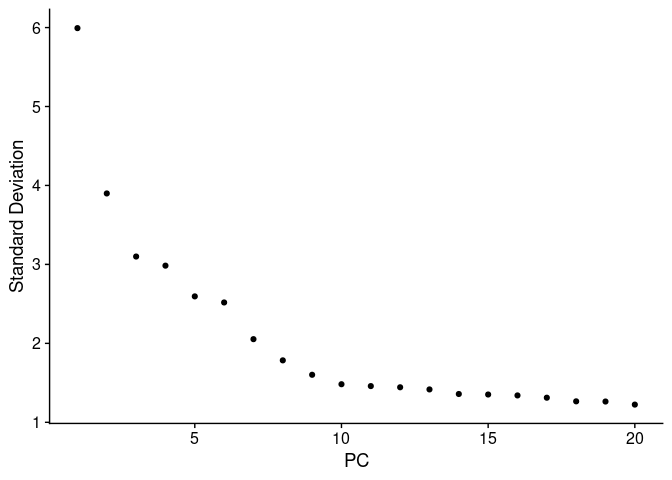
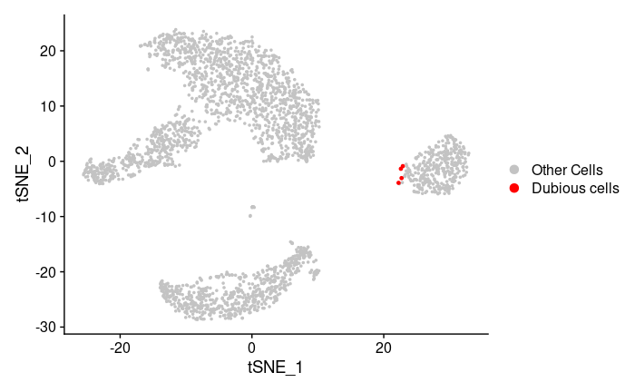
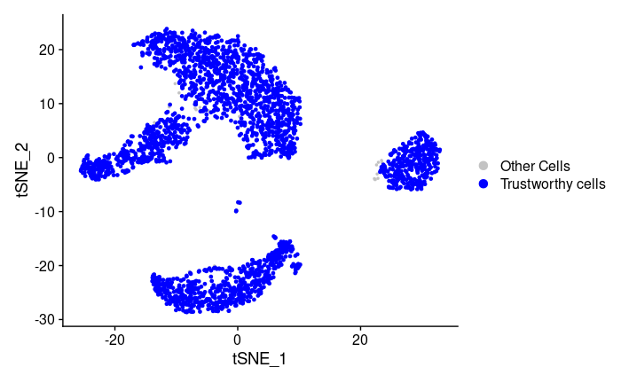
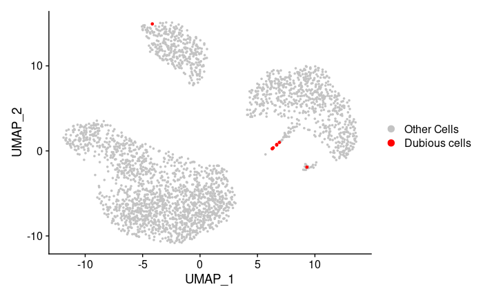
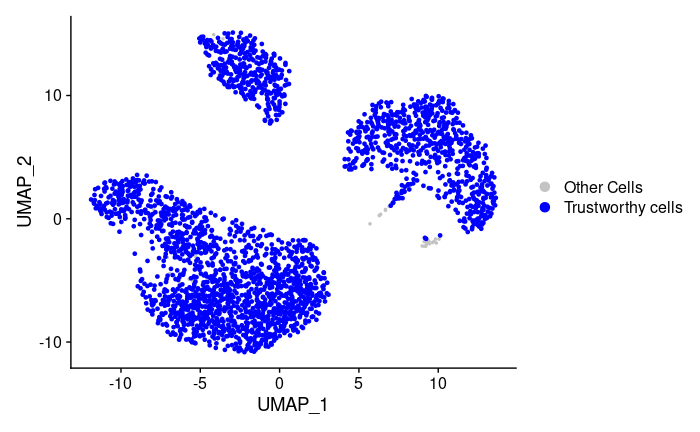

<!-- README.md is generated from README.Rmd. Please edit that file -->

# scDEED (single-cell dubious embedding detector): a statistical method for detecting dubious non-linear embeddings
This package is used for determining the reliability of non-linear dimension reduction embeddings.
It provides functions to detect dubious cells and trustworthy
cells in tSNE and UMAP embeddings. Furthermore, by minimizing the number of dubious
cells, functions in this package find the best perplexity
parameter of tSNE and best n.neighbors parameter of UMAP.

## Installation
You can install the released version of scDEED from GitHub with:

``` r
library(devtools)
devtools::install_github("JSB-UCLA/scDEED")
```

## Example

This is a basic example showing how to find the best parameter.
We use pmbc data as a demo:

``` r
suppressPackageStartupMessages(library(scDEED))
data(pbmc.data)
```

### Choose the suitable dimension (num\_pc)

``` r
chooseK(pbmc.data)
```
ChooseK plot:

 

### Example for umap

``` r
umap_example <- umap_tsne_process(pbmc.data , num_pc = 10, use_method = "umap",visualization = TRUE)
```

``` r
umap_example$`UMAP plot with dubious cells`
```

Dubious plot associated with the best parameter:
 

``` r
umap_example$`UMAP plot with trustworthy cells`
```
Trustworthy plot associated with the best parameter:
 

### Example for tsne

``` r
tsne_example <- umap_tsne_process(pbmc.data, num_pc = 10, use_method = "tsne",visualization = TRUE)
```

``` r
tsne_example$`tSNE plot with dubious cells`
```

Dubious plot associated with the best parameter:
 

``` r
tsne_example$`tSNE plot with trustworthy cells`
```
Trustworthy plot associated with the best parameter:
 
